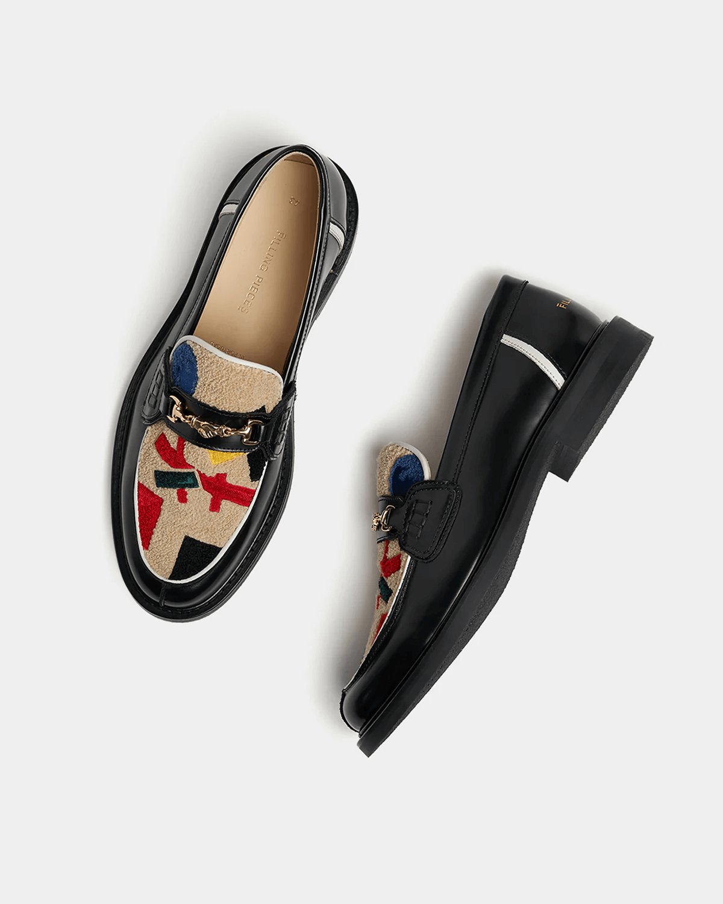
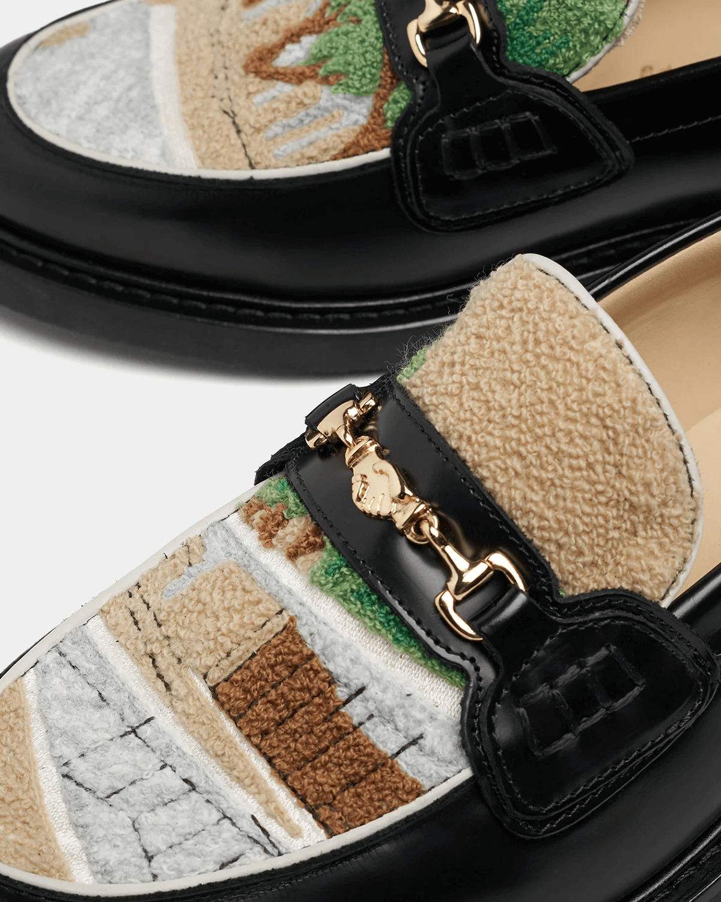
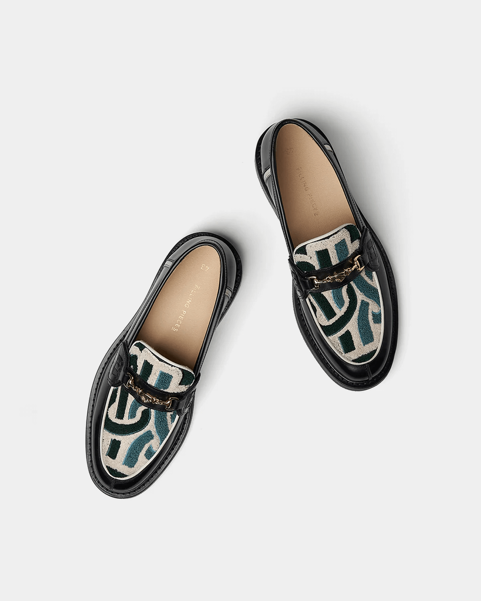

# Filling Pieces: Bridging the Gap Between Luxury and Streetwear

Filling Pieces is a Dutch footwear brand that seamlessly blends luxury and streetwear. Founded in 2009, the brand is known for its innovative designs and premium materials. Every pair of shoes is handcrafted in Portugal, ensuring attention to detail and high-quality craftsmanship. Filling Pieces aims to create shoes that not only look good but also provide comfort and durability, making them a standout in the world of high-end sneakers and loafers.

#### **Loafer Bauhaus Black**
The Loafer Bauhaus Black takes inspiration from the Bauhaus design philosophy, known for its minimalist and functional aesthetic. Crafted from premium black leather, this loafer is a perfect combination of elegance and simplicity. Its sleek design makes it versatile for both casual and formal settings.

#### **Loafer Pavilion Black**
With a more structured silhouette, the Loafer Pavilion Black offers a sophisticated look. Featuring a refined black leather upper and a smooth finish, this shoe is designed for those who appreciate both style and comfort. It's the ideal choice for modern professionals.

#### **Loafer Gowtu Black**
The Loafer Gowtu Black is a luxurious take on the classic loafer. Made with premium materials, this shoe features subtle gold-tone accents, adding a touch of opulence to its sleek black exterior. It's a bold yet elegant choice for those who want to make a statement.

