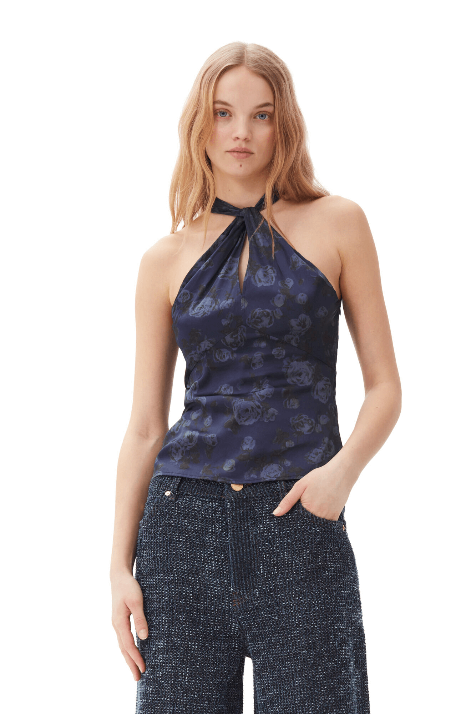

# Discover Ganni: Where Style Meets Sustainability

Ganni is a contemporary fashion brand hailing from Denmark, celebrated for its vibrant designs and commitment to sustainability. With a vision that embraces individuality and creativity, Ganni creates pieces that allow wearers to express themselves while making environmentally conscious choices. The brand is known for its playful prints, innovative silhouettes, and a unique blend of classic and modern elements, making it a favorite among fashion enthusiasts.

This season, we invite you to explore three standout pieces that epitomize Ganni's design philosophy:

  

**Black and White Faux Fur Coat** (€695)  
This coat is a true statement piece that seamlessly blends luxury with comfort. Its chic design makes it a versatile addition to any wardrobe, perfect for layering over your favorite outfits while keeping you warm and stylish.

  

**Dark Blue Floral Printed Top** (€175)  
Showcasing Ganni's signature playful prints, this top is crafted with care and is ideal for those looking to add a touch of vibrancy to their ensemble. Pair it with high-waisted jeans for a casual day out or a sleek skirt for a night on the town.

**Black Boucle Maxi Dress** (€395)  
Exuding elegance and sophistication, this dress features a timeless silhouette and luxurious fabric, making it perfect for any occasion. It effortlessly transitions from day to night, ensuring you always look your best.

Experience the perfect blend of style and sustainability with Ganni. Elevate your wardrobe with these exquisite pieces that not only look good but also do good.
