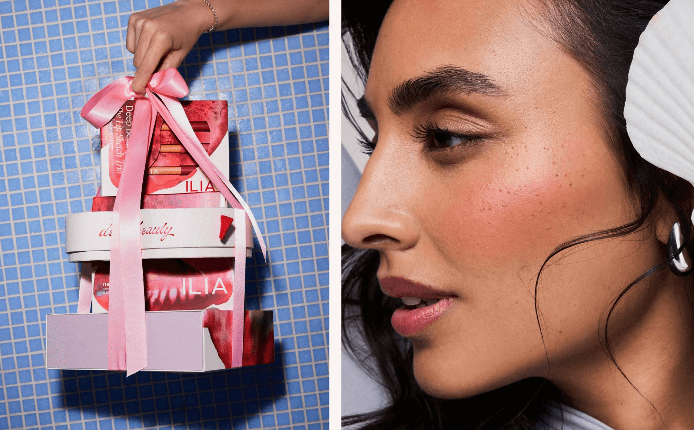
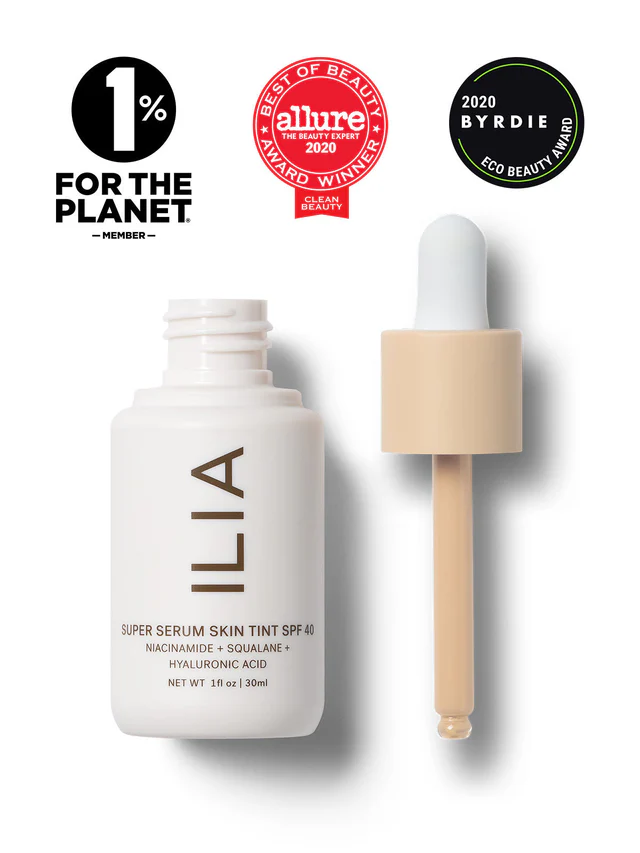
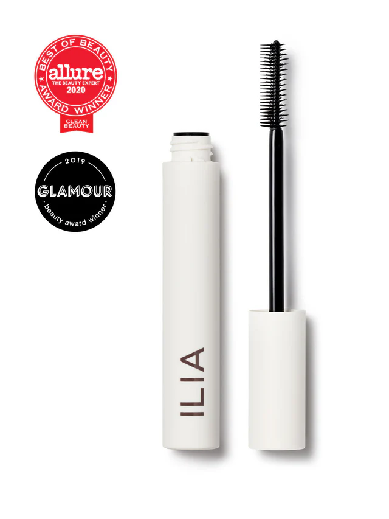
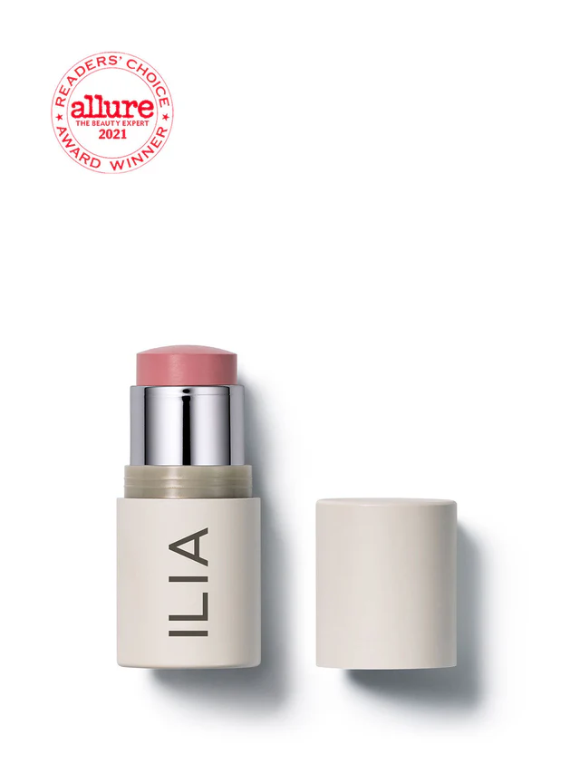

# ILIA Beauty: Clean Beauty, Redefined

ILIA Beauty is a forward-thinking beauty brand focused on creating high-performance products that prioritize both your skin and the planet. With a commitment to sustainability, ILIA uses clean, organic ingredients combined with effective, safe formulas that deliver impressive results. The brand believes that makeup can be both beautiful and skin-friendly, offering products that nourish and protect while enhancing natural beauty.

### Product Highlights

#### 1. **Super Serum Skin Tint SPF 40**
This award-winning serum foundation is a multitasking powerhouse. Infused with hyaluronic acid, squalane, and niacinamide, it hydrates, smooths, and protects the skin while providing light coverage and SPF 40 sun protection. Ideal for a dewy, natural look, this product is perfect for those who want makeup that works with their skin.

#### 2. **Limitless Lash Mascara**
A clean mascara that actually works. With a 99% natural formula, this mascara lengthens, lifts, and nourishes lashes. The dual-sided brush allows for precision application, ensuring every lash is separated and defined for a bright-eyed, bold look.

#### 3. **Multi-Stick**
The versatile Multi-Stick is a must-have for anyone on the go. Use it as blush, lip color, or eyeshadow. The creamy, blendable formula glides on effortlessly, giving a subtle flush of color while hydrating the skin with nourishing ingredients like shea butter and avocado oil.

