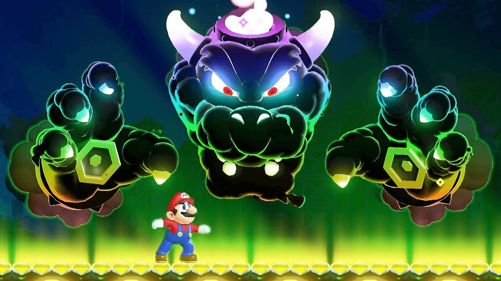

# Super Mario Bros. Wonder: An Adventure Through a Fantastical World

In the long history of gaming, Mario is undoubtedly an iconic character. He is not only Nintendo's mascot but also a hero in the hearts of countless players. From his first appearance as a plumber in "Donkey Kong" to his various adventures today, each of Mario's outings comes with endless surprises and joy. Today, let's talk about those surprising moments in the Mario franchise.
#### Unexpected Worlds

One of the charms of the Mario series lies in its unique and imaginative worlds. Each new installment brings players new environments and challenges. For instance, in "Super Mario Odyssey," Mario not only explores a vast "open world" but also uses his new hat ability to defeat enemies and solve puzzles. This innovative gameplay allows players to experience fun that is entirely different from previous games and keeps us excited for each new adventure.

#### Surprise Character Additions

Mario's world is always filled with unexpected characters. From friends to foes, each character in the games has its own unique personality and background. In "Super Mario 3D World," we see Mario in his cat form and the introduction of new gameplay mechanics. Meanwhile, in "Mario Kart," players can even race alongside characters from other game franchises, which is both surprising and thrilling.

#### The Return of Classics

While the Mario games are always fresh, the return of classic elements also brings surprise. Whether it's the classic "Super Mushroom" or "Fire Flower," these elements always evoke a sense of nostalgia in players. In "Super Mario 3D All-Stars," players can relive three classic games from earlier eras, providing an experience that touches the hearts of many veteran players.

#### Stunning Music

The music in Mario games is also a significant part of their charm. The classic theme songs and level background music accompany our adventures and provide a delightful experience. In each new installment, the arrangement of the music is always refreshing, and in "Super Mario Odyssey," the inclusion of orchestral performances brought an unprecedented musical experience.

#### Conclusion: The Endless Surprises of Mario

In summary, Mario's world is a fantastical adventure filled with surprises. In this world, every jump and challenge could bring unexpected joy. From unique level designs to the addition of new characters, Mario always brings us freshness and surprise.

Whether you're a new player or a veteran, Mario's adventures continue to await us. Let's look forward to more surprises in the future and explore this marvelous world with Mario!

