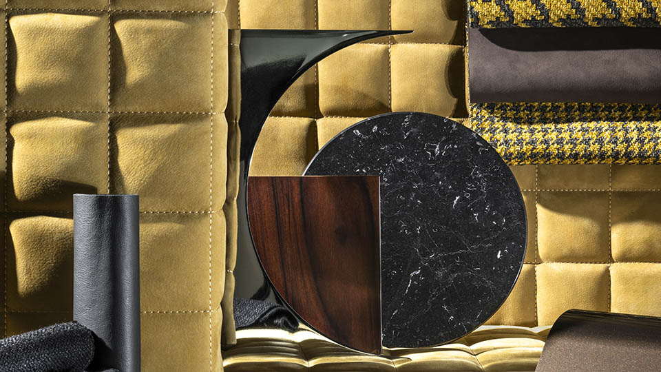
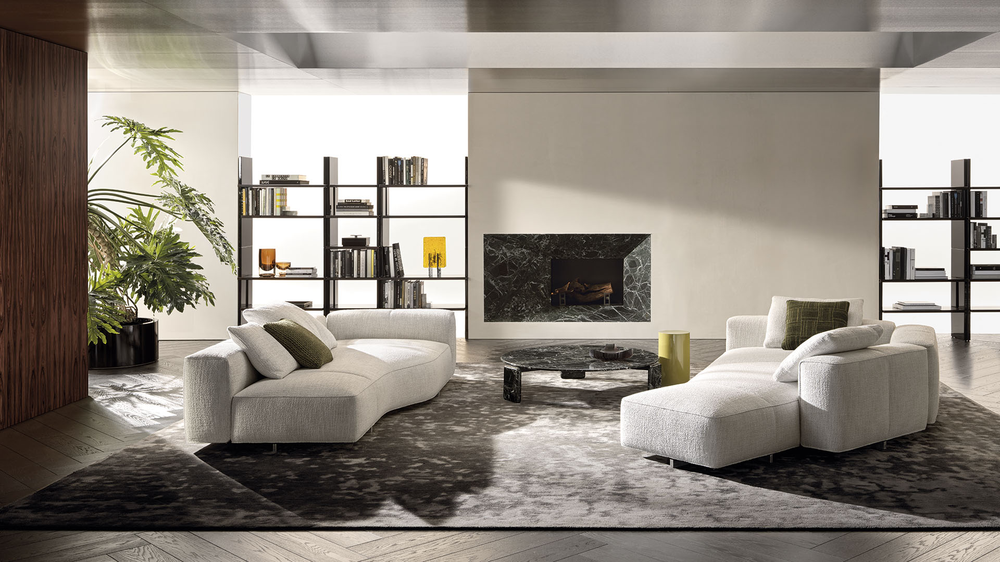
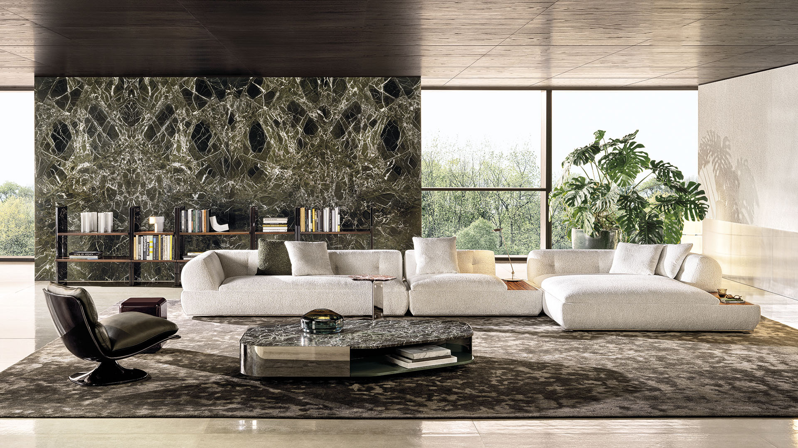
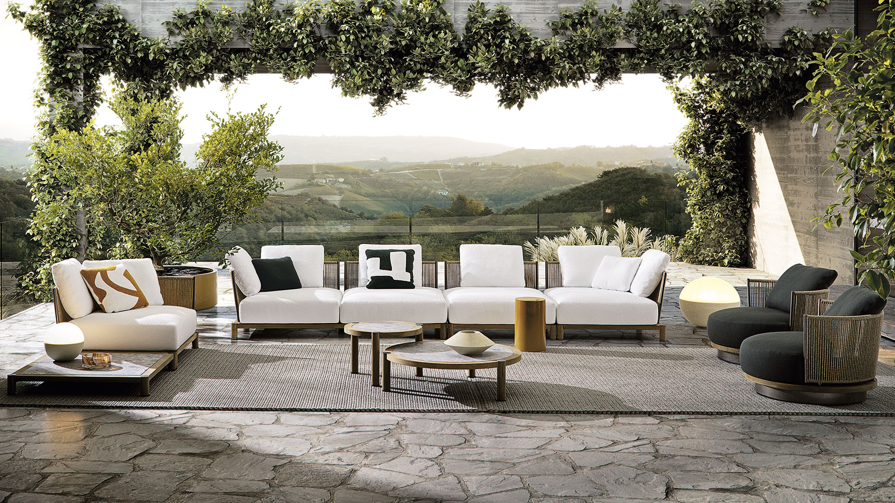
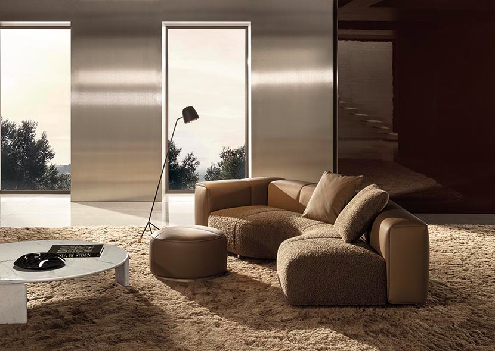
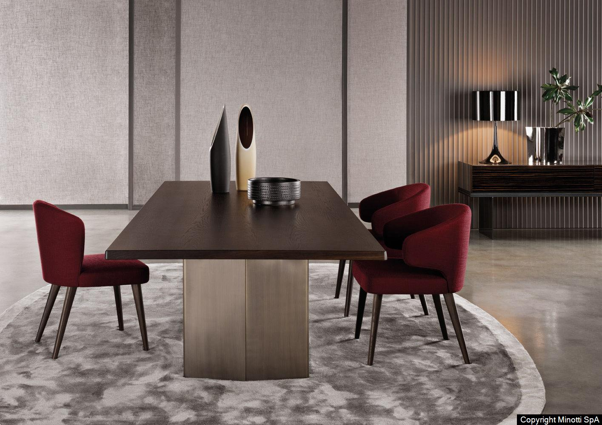
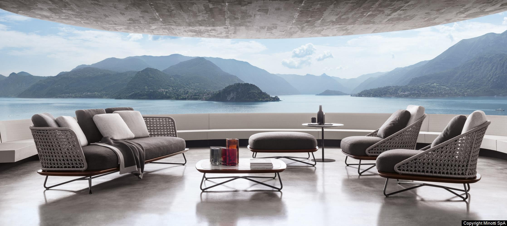
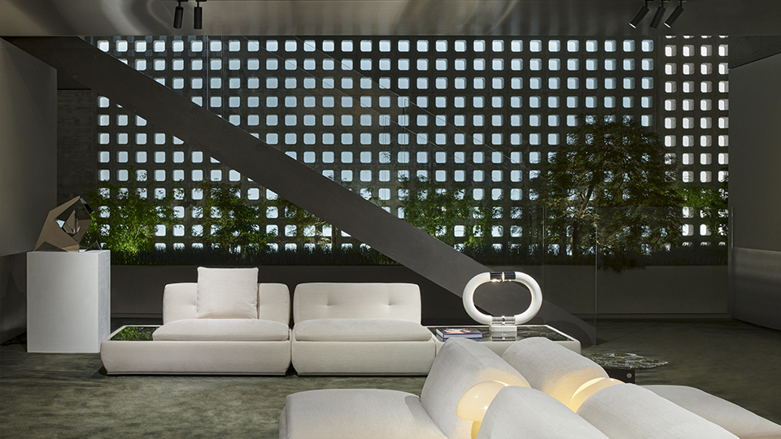
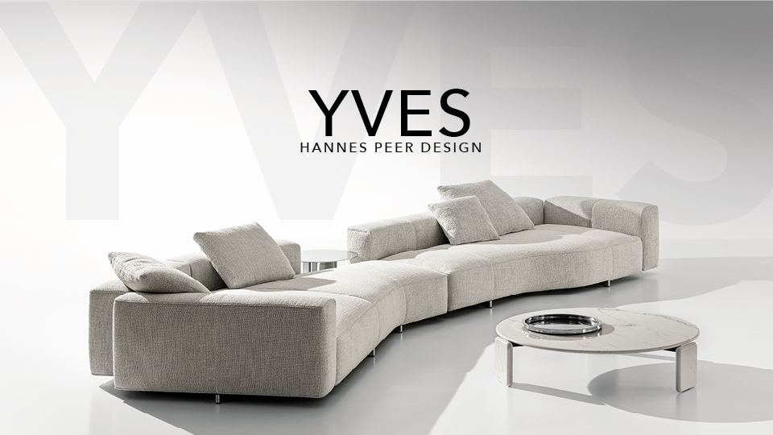

# Discover the Timeless Elegance of Minotti Furniture

When it comes to high-end Italian furniture, **Minotti** stands out as a symbol of timeless elegance and sophisticated design. With a heritage rooted in craftsmanship and innovation, Minotti blends tradition with modern aesthetics, creating pieces that are both stylish and functional.

## Why Choose Minotti?

Minotti is renowned for its meticulous attention to detail and use of premium materials. Whether you’re furnishing a luxurious living room or a sleek office space, Minotti offers a wide range of furniture that seamlessly integrates into any environment. From plush sofas to refined coffee tables, each piece is designed to elevate your living space.

### Key Features of Minotti Furniture:

- **Superior Craftsmanship:** Minotti furniture is handmade by skilled artisans, ensuring that every detail is perfect.
- **Innovative Design:** Combining contemporary style with timeless elegance, Minotti pieces are designed to be both beautiful and practical.
- **Sustainable Practices:** Minotti is committed to environmentally responsible production, using sustainable materials and processes.

  
## Minotti Collections

Minotti’s collections are constantly evolving, with new designs that push the boundaries of modern furniture. Here are a few standout collections:

### 1. **Lawrence Sofa Collection**
   The **Lawrence** sofa collection embodies a perfect balance of luxury and comfort. Its modular design allows for flexibility, making it a versatile addition to any living room.

   

### 2. **Aston Dining Table**
   The **Aston** dining table combines sleek lines with a bold presence. Available in a range of finishes, this table is a masterpiece that brings elegance to any dining area.

  

### 3. **Clever Armchair**
   The **Rivera** armchair is a perfect blend of ergonomic comfort and chic design. Its sleek frame and comfortable upholstery make it an ideal choice for relaxation.

   

## Where Art Meets Function

Minotti’s furniture is more than just beautiful pieces; they are designed with functionality in mind. Whether you're looking to create a cozy retreat or a modern statement space, Minotti provides the perfect combination of luxury, comfort, and innovation.

## Transform Your Space with Minotti

Choosing Minotti means investing in quality and timeless design that will last for generations. Each piece is not only an art form but also a functional part of your home, offering both aesthetic appeal and lasting comfort. Explore Minotti's exquisite collections today and take the first step in transforming your living space.

