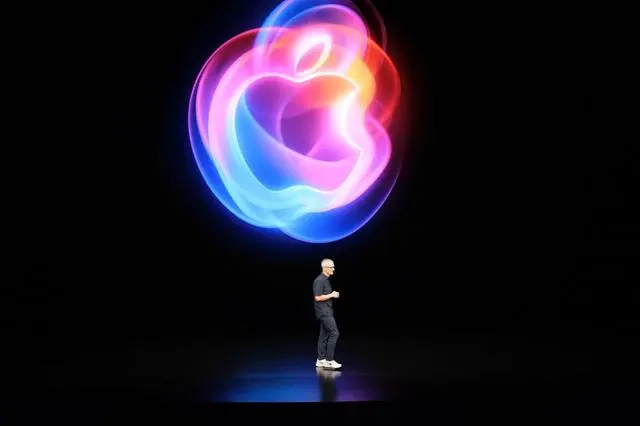
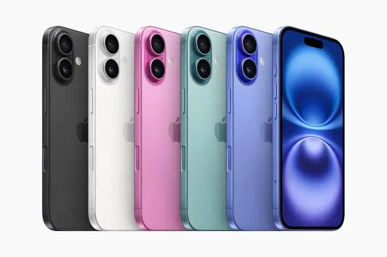
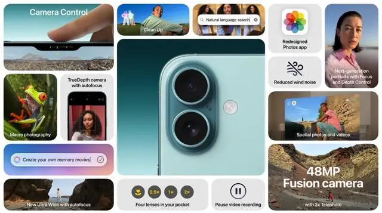
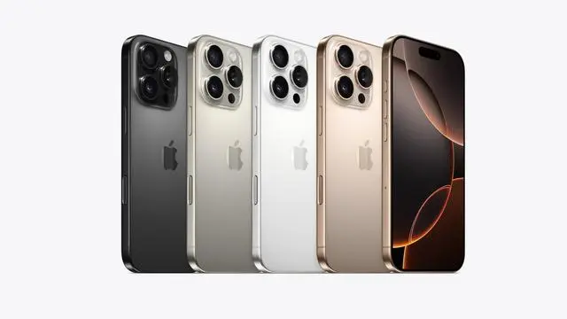
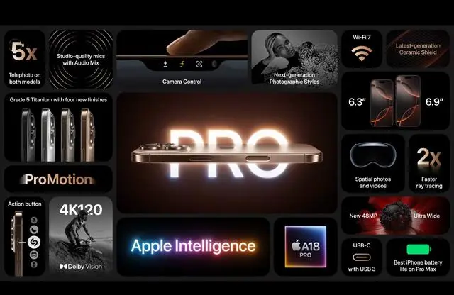
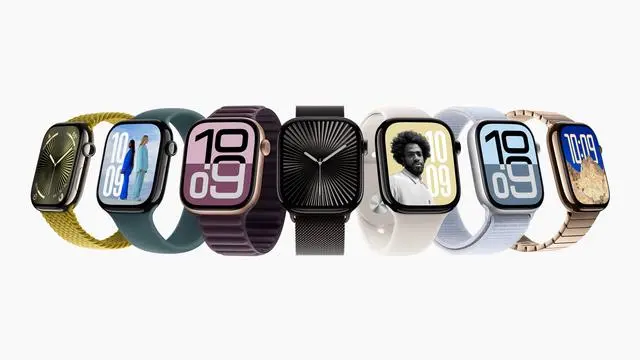
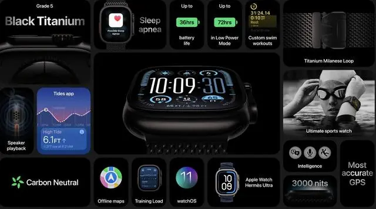
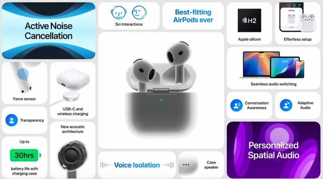
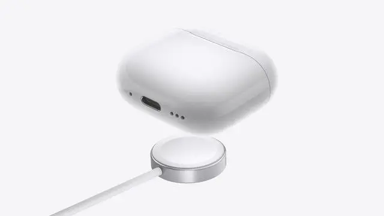

# Summary of Apple's Fall 2024 Event

#### Launching Eight New Products at Once! Summary of Apple's Fall 2024 Event

On the morning of September 10th, Apple held its 2024 Fall Product Launch Event, introducing eight new hardware products, including the iPhone 16 series, featuring several upgrades and surprises. Although the iPhone 16 series has minimal changes in appearance, there are still many highlights in hardware and functionality upgrades. The upgrades for the Apple Watch Series 10 are quite significant, and there's also the brand new AirPods 4 series.

#### iPhone 16 and iPhone 16 Plus

Aside from the 60Hz refresh rate, there are no obvious drawbacks in other aspects. Performance-wise, they are equipped with the A18 chip and 8GB of RAM, and the cooling system has been upgraded again, resulting in an improved gaming experience. The screens are 6.1 inches and 6.7 inches, featuring OLED full displays with a new minimum brightness of 1 nit. The screen cover has been upgraded to a more robust next-generation ultra-ceramic panel. In terms of imaging, the ultra-wide-angle lens has improved aperture, and new features include macro photography, spatial photos, and spatial video recording, along with a mixing function that enhances voice clarity.

The body now features a camera control button similar to that of the Pro models, making it faster and easier to capture photos, particularly for snapping pets and children, as well as recording spatial videos. Additionally, it introduces fun new photography styles. Compared to previous models, both new devices have seen varying degrees of improvement in battery life, with a charging speed that remains at 50% in just 30 minutes. The mute button on the left side has been upgraded to a Pro-style operation button, and five color options are available. The domestic version does not currently support Apple Intelligence. 

#### iPhone 16 Pro and iPhone 16 Pro Max

In terms of performance, the upgrade from the A17 Pro to the A18 Pro has led to a significant improvement in battery life, especially with the screen size increase. This is likely the result of advancements in manufacturing processes and battery capacity. The screens now feature a new size, with the Pro version upgraded from 6.1 inches to 6.3 inches, and the Pro Max version upgraded from 6.7 inches to 6.9 inches, along with a narrower four-edge design. Here’s an interesting tidbit: the width of the iPhone 16 Pro is the same as that of the iPhone 14 Pro, and the width of the iPhone 16 Pro Max matches that of the iPhone 14 Pro Max.

The screen brightness has not been upgraded; it now features a minimum brightness of 1 nit, and the screen ratio is slightly elongated, though the adjustment is minimal. The imaging system has been upgraded again, with the ultra-wide-angle lens increasing from 12 megapixels to 48 megapixels, and all models support 5X optical zoom. New features include a new generation of photography styles and 4K 120FPS Dolby Vision recording. Unfortunately, spatial video currently supports a maximum of only 1080P at 30FPS, though an OTA update in the future is not ruled out. The device also introduces mixing effects and four studio-quality microphones. The body continues to use a titanium metal frame, with four color options available.

#### Apple Watch Series 10

Compared to its predecessor, the Apple Watch Series 10 has seen comprehensive upgrades. It features the new S10 SIP chip for enhanced performance, and the case sizes have been upgraded to 42mm and 46mm, with the 46mm version having a screen area that exceeds that of the Apple Watch Ultra 2. A titanium version has been introduced, resulting in a noticeable reduction in both thickness and weight; however, the battery life remains at 18 hours. New features include a water temperature sensor, depth gauge, and a water depth app that supports depths of up to 6 meters, which can be used in conjunction with the Oceanic+ app for snorkeling.

#### Apple Watch Ultra 2 Black

As the name suggests, the black version of the Apple Watch Ultra is simply a black variant of the previously released white model. According to official specifications and data, there are no differences between the two. In comparison to the Apple Watch Series 10, there are notable differences in battery life, screen brightness, scuba diving capabilities, dual-frequency GPS, and weight. For regular users, it's advisable not to rush into purchasing the launch version; currently, the original color version's price has dropped significantly on third-party platforms, and it's just a matter of time before the black version follows suit.

#### AirPods 4th Generation

Currently, there are standard and active noise-cancelling versions available, both of which do not require silicone ear tips and offer improved comfort during wear. In terms of chips, they are equipped with the same H2 chip as the Pro model, adding personalized spatial audio and dynamic head tracking features, with battery life upgraded to 30 hours when used with the charging case. The charging case for both models has only been upgraded to a USB-C interface, while the active noise-cancelling version's charging case supports wireless charging and can also be charged using an Apple Watch charger. Additionally, it features a built-in speaker for the Find My function.

The AirPods 4 are equipped with dust resistance and IP54 sweat and water resistance features. The Bluetooth version has been upgraded from 5.0 to 5.3, and the charging case is now smaller and lighter. In comparison, the active noise-cancelling version is essentially a version of the AirPods Pro 2 without ear tips, with the main differences being in hearing features (conversation enhancement, volume reduction, background noise) and the charging case, making it an excellent alternative to the AirPods Pro. The pricing is also quite appealing.

#### AirPods Max

This product belongs to the "unexpected" category. The first surprise is that it was updated after four years, and the second is that the update only included new colors and a change in the charging port. In December 2020, Apple released the AirPods Max, and according to available data, its sales and reputation have been fairly average in the domestic market. This update brings five new color options: Midnight, Starlight, Blue, Purple, and Orange, with the charging port upgraded to the more mainstream USB-C. The price remains the same as it was four years ago, and purchasers receive three months of free Apple Music trial.

#### Wildfireon Summary:

Regarding Apple's Fall Product Launch Event, my thoughts are as follows: Perhaps this year's leaks were quite accurate, which overall resulted in more pleasant surprises than disappointments, whether it's the iPhone 16 series, the Apple Watch Series 10, or the AirPods 4 series. I’ve seen many netizens complaining about the appearance. It's essential for online shoppers to understand one thing: most products that are only $9.99 with free shipping rely on new designs to stand out. If Apple were to ever reach that level, it would be the most disappointing situation. Some bloggers summed it up as “garbage,” and if you can find their summary from last year, it likely contained the same two words. Hundreds of millions of people around the world are purchasing what they call “garbage.” Just think about it for a moment, and you'll realize where the real problem lies. Another point is that complaints can be expressed in two words, but providing a review requires knowledge and the ability to detail the product's pros and cons.

