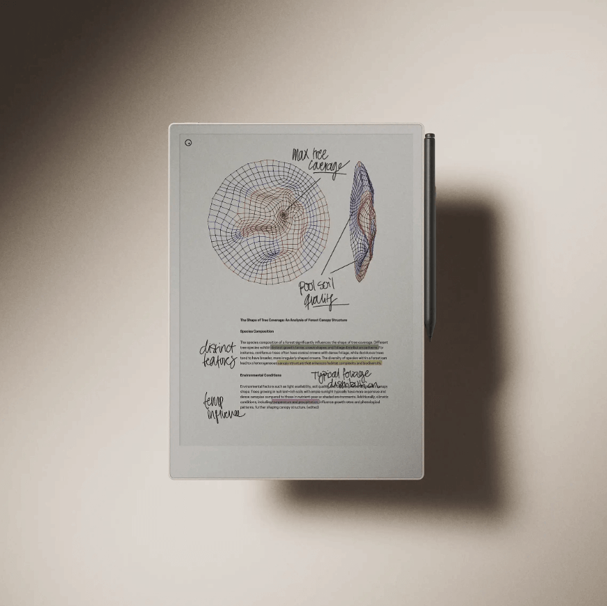

# reMarkable Paper Pro vs. reMarkable 2

Unsure which paper tablet suits your needs? You're in the right place. Continue reading to discover the differences between two of the most powerful tools for thinking and organization.

#### What Makes a Paper Tablet?
Both of our paper tablets were created with a singular purpose: to enhance focus while taking notes, reviewing documents, and staying organized. However, they differ in terms of size, features, and pricing. The reMarkable 2, launched in 2020, quickly became a favorite in tech circles and a top choice for millions of knowledge workers worldwide.

The reMarkable Paper Pro, our newest offering, builds on this foundation, incorporating advanced hardware to take digital note-taking to the next level.

Both devices offer a fantastic writing experience, featuring intuitive, distraction-free software (reMarkable OS) and a two-week battery life, but several key distinctions set them apart.

#### A Leap in Color Technology

The most notable difference between the two tablets is the reMarkable Paper Pro's new Canvas Color display. This cutting-edge technology integrates millions of color ink particles, producing rich and natural hues never before seen on digital paper. These colors reflect ambient light, offering a calm and immersive reading and writing experience. Despite its complexity, this new technology brings the writing sensation even closer to that of pen on paper.

Meanwhile, the reMarkable 2 features a monotone Canvas display capable of producing black, white, and various shades of gray. Although the reMarkable 2 cannot display colors natively, they are visible upon exporting content or within external apps.

#### Beyond the Surface

The introduction of color transforms note-taking into a more dynamic and productive activity. It enables easier memory retention, organization, and productivity. With color-coding, important information is easily highlighted, helping you focus on and recall key details. It also simplifies task management, as categorizing information becomes more intuitive.

Colorful, customized notes encourage deeper interaction, enhancing memory and motivation. Plus, using color can evoke emotions and inspire creativity, making your notes more engaging and expressive.

#### A Larger Display

The reMarkable Paper Pro’s Canvas Color display spans a generous 11.8 inches, compared to the reMarkable 2's 10.3 inches. The larger screen allows more information to be viewed at once and provides ample room for note-taking. PDFs appear full-sized, making it easier to add thoughts, comments, and annotations. Despite the expanded display, the device remains ultra-portable, measuring just 5.1 mm in thickness — even slimmer than most smartphones.

#### Read Day or Night in Comfort

One of the main challenges in designing digital notebooks has been adding display lighting without increasing screen thickness. This was the reason we did not include a reading light with the reMarkable 2 when it debuted in 2020.

A thicker display creates a disconnect between the Marker tip and the digital ink, making the writing experience less tactile. The reMarkable Paper Pro is the first device to illuminate its display without adding this gap, preserving the natural writing experience we’re so proud of. Now, you can read and write comfortably, day or night, while maintaining that authentic paper feel.

#### Even Closer to Real Paper

Despite the inclusion of the reading light and color display, the reMarkable Paper Pro offers one of the most authentic paper-like writing experiences available. Advances in the interaction between the Marker tip, textured screen, and custom software have brought responsiveness and tactility to an unprecedented level. Latency — the time it takes for ink to appear — has been reduced by 40% compared to the reMarkable 2. Additionally, the durability of the Marker tips has improved, with new tips lasting more than twice as long.

#### A Sustainable Approach
The reMarkable Paper Pro introduces important sustainability enhancements. Its battery contains 50% recycled cobalt, the Folios are made from recycled polyester materials, and the device's internal locking mechanism has been redesigned to improve repairability. Sustainability was carefully balanced with durability during the design process to ensure the device is as eco-friendly as possible while maintaining long-term durability.

#### A Design Tailored to Your Preferences
In addition to its advanced features, the reMarkable Paper Pro provides a wider selection of Folio colors and materials, allowing for more personalization while protecting your tablet. The new Book Folios still attach magnetically but now include a strap to secure your Marker or Marker Plus.

These new covers are smarter too, offering an auto wake-up function when opened or closed. Both tablets are compatible with their respective Type Folios, but the reMarkable Paper Pro's Type Folio offers more room, including palm rests and a dedicated refine key for editing text with the Marker.
